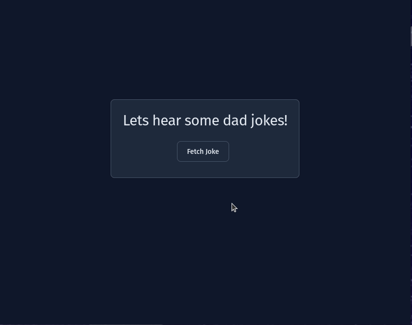

# ReactJS Dad Joke App
This is a small and simple ReactJS project to incorporate the material which I have read from Fullstack React. It's focus was to create an application that uses components and have props be passed down to the components while having the top component maintain the application state.


This application uses the dad joke API from https://icanhazdadjoke.com/. The app has a simple interface with one button which the user can click to retrieve one or many dad jokes.


Example GIF:


## Running the appplication

Run app locally
```shell
npm run dev
```

Run tests
```shell
npm run test
```

Create a build
```shell
npm run build
```
